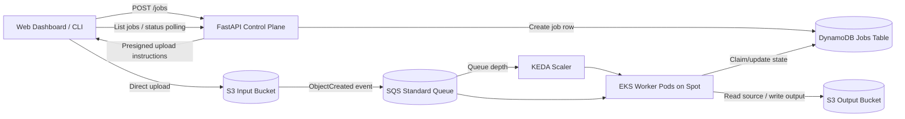

# Elastic

Elastic is a backend capstone focused on one hard problem: running heavy video transcodes on cheap, interruptible compute without losing track of work.

The v1 system is intentionally narrow. A web dashboard or CLI asks the API for upload instructions, uploads a source video directly to S3, and then a queue-driven worker fleet processes the file on EKS. The interesting part is not the upload or the transcode itself. The interesting part is that the system is designed to survive duplicate events, long-running jobs, and Spot interruptions while still presenting a coherent job record to the client.

## What This Project Proves

- Large payloads do not flow through the API server.
- Upload and compute are decoupled through durable queueing.
- Workers scale from zero based on queue depth.
- Long-running jobs can tolerate pod or node interruption and retry safely.
- DynamoDB acts as the durable source of truth for job progress.
- A browser dashboard can create jobs, upload directly to S3, and monitor job state.

## Core MVP Story

1. The dashboard or CLI creates a job with `POST /jobs`.
2. The client uploads the video to S3 using a deterministic object key.
3. S3 emits an object-created event into SQS.
4. KEDA scales worker pods on EKS based on queue depth.
5. A worker claims the job, extends SQS visibility while transcoding, and writes state changes to DynamoDB.
6. If the worker is interrupted, the message becomes visible again and another worker retries the job safely.
7. On success, the final output is stored under a deterministic output key and the job is marked `COMPLETED`.

## Architecture



## Resilience Story

Elastic is not trying to promise exactly-once compute. The system is built around more realistic guarantees:

- At-least-once event delivery is expected from S3 and SQS.
- DynamoDB conditional writes prevent conflicting state transitions.
- Workers are idempotent from the client's point of view: duplicate delivery may cause repeated attempts, but not conflicting final job state.
- Spot interruption is treated as a normal operating condition, not an exceptional disaster.

That makes the project a good backend systems demo because the architecture is justified by failure modes, not by service-count.

## Demo Path

The portfolio demo for v1 should show five things clearly:

1. A client creates a job and uploads a video directly to S3.
2. The queue receives work and worker pods scale above zero.
3. A transcode starts and job state moves through DynamoDB.
4. A worker is interrupted mid-job and the task becomes available again.
5. Another worker completes the job and the final artifact appears at the expected key.

## Current Scope

The current repo phase is the local implementation slice that proves the browser dashboard, API, worker, and LocalStack-backed job flow work end to end. The implementation target for the first finished MVP is:

- FastAPI API
- Browser dashboard
- S3 direct upload
- SQS-backed job trigger
- EKS worker pods
- KEDA autoscaling
- DynamoDB job ledger
- One output preset: `1080p`

Explicitly out of scope for v1:

- Step Functions
- Multi-rendition fan-out
- HLS packaging
- Claims of proven 10GB+ production performance before benchmark data exists

## Repo Direction

This repo starts with a design-first workflow:

- [docs/architecture.md](docs/architecture.md): system boundary, data flow, guarantees, and failure model
- [docs/mvp.md](docs/mvp.md): implementation contract for the first buildable version
- [docs/aws-deploy.md](docs/aws-deploy.md): AWS deployment runbook, management commands, and teardown flow

Once those docs are accepted, the codebase will grow into:

- `apps/api`
- `apps/worker`
- `apps/web`
- `infra`

## Local Development

The API can now run against either the in-memory store or real DynamoDB, S3, and SQS resources in LocalStack.

Before running the smoke test, install `ffmpeg` and `ffprobe` locally. The smoke path uses the checked-in video fixture at [`fixtures/media/file_example_MP4_1920_18MG.mp4`](fixtures/media/file_example_MP4_1920_18MG.mp4).

The easiest way to bring the whole local stack up is:

```bash
uv run python scripts/dev_up.py
```

That command will start LocalStack when the local AWS endpoint points at `localhost`, then bring up the API, worker, and dashboard if they are not already running.
It also skips any service that is already healthy, so you can rerun it without accidentally spawning duplicates.

Under the hood, the API still owns the bootstrap step for local resources:

```bash
ELASTIC_AUTO_CREATE_JOBS_TABLE=true
ELASTIC_AUTO_CREATE_INPUT_BUCKET=true
ELASTIC_AUTO_CREATE_INGEST_QUEUE=true
ELASTIC_AUTO_CONFIGURE_BUCKET_NOTIFICATIONS=true
```

When the input bucket is auto-created, the local bootstrap also configures S3 CORS so the browser dashboard can upload directly to LocalStack.

### Smoke Test

With LocalStack and the API running, you can exercise the current API slice with:

```bash
bash scripts/smoke_api.sh
```

That script now creates a job, uploads a sample file through the returned presigned S3 `PUT` URL, and keeps polling the worker until that specific job reaches `COMPLETED`.

If you want a more verbose local lab run that prints API, DynamoDB, SQS, and S3 snapshots while the worker runs, use:

```bash
uv run python scripts/lab_watch.py
```

To run the dashboard locally, use:

```bash
cd apps/web
npm run dev
```

The dashboard points directly at the local FastAPI app via `apps/web/.env.local`, and the API enables local CORS when it is running against LocalStack. If you change that env file, restart the Vite dev server so it picks up the new base URL.

### Container Images

Build the API and worker images with:

```bash
docker build -f apps/api/Dockerfile -t elastic-api .
docker build -f apps/worker/Dockerfile -t elastic-worker .
docker build -f apps/web/Dockerfile -t elastic-web apps/web
```

### Kubernetes Base Manifests

The first deployable Kubernetes layer lives in [`infra/k8s/base`](infra/k8s/base).
It includes:

- a namespace
- a shared runtime config map
- API and worker service accounts
- the API deployment plus ClusterIP service
- the worker deployment running in long-poll loop mode
- the web dashboard deployment plus ClusterIP service

Build or tag the images so they match the manifest names:

```bash
docker build -f apps/api/Dockerfile -t elastic-api:latest .
docker build -f apps/worker/Dockerfile -t elastic-worker:latest .
docker build -f apps/web/Dockerfile -t elastic-web:latest apps/web
```

Apply the manifests:

```bash
kubectl apply -k infra/k8s/base
```

For quick local access to the API:

```bash
kubectl port-forward -n elastic svc/elastic-api 8000:80
```

For the dashboard, port-forward the web service:

```bash
kubectl port-forward -n elastic svc/elastic-web 5173:80
```

The web container proxies `/api` to the in-cluster API service, so port-forwarding the dashboard is enough for a browser demo once both services are running.

The service accounts are the hooks for IRSA later, when we wire the AWS roles for DynamoDB, S3, and SQS access.

Or manually:

```bash
curl -sS -X POST http://127.0.0.1:8000/jobs \
  -H "Content-Type: application/json" \
  -d '{
    "filename": "sample.mov",
    "content_type": "video/quicktime",
    "size_bytes": 73400320,
    "preset": "1080p"
  }'
```

Then fetch the created job:

```bash
curl -sS http://127.0.0.1:8000/jobs/<job_id>
```
